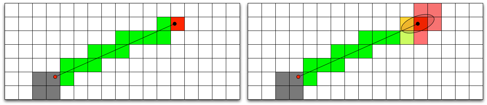

William J. Woodall IV
=====================

---

Outline
=======

* Pre-Collegiate
    * BEST Robotics
* Undergraduate College
* Graduate College
* Master's Work
* ROS Experience

---

Pre-Collegiate
==============

* Born on December 17th, 1986 (25)
* Born in Decatur, AL
* Attended Austin High School in Decatur, AL

BEST Robotics
-------------

* High school team member
* Mentored high school team
* A-Team, top-level technical volunteer

---

BEST Robotics
-------------

<iframe width="853" height="480" src="http://www.youtube.com/embed/lxtXY4SXi2c" frameborder="0" allowfullscreen style="float: right"></iframe>

---

Outline
=======

* Pre-collegiate
* Undergraduate College
    * IEEE SouthEastern Conference
    * NASA Lunar Regolith Excavator Competition
    * ION Autonomous Lawnmower Competition
* Graduate College
* Master's Work
* ROS Experience

---

Undergraduate College
=====================

* 3.65 Major GPA
* B.S. Degree in Software Engineering

Undergraduate Extracurriculars:

* AUSSP (Student Satellite Team)
* SPaRC (Student Projects and Research Committee)
    * IEEE SECon Student Hardware Competition
* Solar Car Decathlon Team
* Autonomous Lawnmower
* NASA Lunar Excavator

---

IEEE SouthEastern Conference
============================

<iframe width="853" height="480" src="http://www.youtube.com/embed/y-UYFPOnJFw" frameborder="0" allowfullscreen></iframe>

2009 I lead the team and we took first place for our recycling robot.

---

IEEE SouthEastern Conference
----------------------------

Robot Specifications:

* 500MHz AMD Geode with 128 Mb of RAM and 2Gb of CF Card
* 4 Hobby servos, 2 Sonar Rangers, 1 Hokuyo LRF, and 1 Yaw gyro
* Custom Gentoo Linux OS with software written completely in Python

---

NASA Lunar Regolith Excavator
=============================

<iframe width="853" height="320" src="http://www.youtube.com/embed/ruQFH1k-lmY" frameborder="0" allowfullscreen></iframe>

* NASA robotics competition in 2010
* We won second place in the competition with 12 Kg moved
* We also won first place in the Engineering Notebook

---

Autonomous Lawnmower - 2010
===========================

Won third place in the dynamic competition

---

Autonomous Lawnmower - 2010
---------------------------

Used RTK GPS, LRF, Encoders, IMU, and Camera

---

Outline
=======

* Pre-collegiate
* Undergraduate College
* Graduate College
    * ARMY Corp. AUXOS Project
    * Autonomous Lawnmower Again
* Master's Work
* ROS Experience

---

Graduate College
================

* 3.88 GPA _currently_
* M.S. Degree (Thesis Option) in Software Engineering

Relevant Course Work:

* Optimal Control and Estimation
* Autonomous Mobile Robotics
* Digital Image Processing
* Computer Graphics (OpenGL) _currently taking_
* Systems Engineering I & II

---

ARMY Corp. AUXOS Project
========================

AUXOS (Autonomous UneXploded Ordinance Surveillance)

* Segway RMP 400
* Polaris Ranger EV
    * Kairos Automation System
* Novatel SPAN GPS RTK+INS

---

ARMY Corp. AUXOS Project
------------------------

Autonomous Polaris Ranger EV

* Path planning is done off-line with survey information
* Boustrophedon and Dubin's Paths combined for coverage planning

---

ARMY Corp. AUXOS Project
------------------------

<iframe width="640" height="480" src="http://www.youtube.com/embed/b7ub1c_KIJE" frameborder="0" allowfullscreen></iframe>

---

Autonomous Lawnmower - 2011
===========================

<ul style="float: right; width: 375px;">
    <li>Took second place in the dynamic competition</li>
    <li>Wrote custom Extended Kalman Filter</li>
    <li>Updated LRF</li>
    <li>Moved AHRS from IMU</li>
    <li>Better ROS integration</li>
</ul>

---

Outline
=======

* Pre-collegiate
* Undergraduate College
* Graduate College
* Master's Work
    * Robot Platforms
    * Accepted ION Paper
    * Master's Thesis
* ROS Experience

---

Master's Work
=============

Three Dimensional Teleoperation with the Microsoft Kinect

Goals:

* Develop 3D and photo-realistic teleoperation capabilities at Auburn
* Introduction into the perception research area
* Involve the innovative and low-cost element by using the Kinect

---

Robot Platforms
=========================

---

ION Paper
=========

Elements:

* Show the Kinect in teleoperation activities
* Show how octrees can help reduce bandwidth
* Suggest method for reducing effects of Kinect error when mapping

---

Master's Thesis
===============

In addition to ION Paper:

* Improve resilience to latency with vehicle model
* Take color image data and apply to octree visualization

---

Outline
=======

* Pre-collegiate
* Undergraduate College
* Graduate College
* Master's Work
* ROS Experience
    * Autonomous Lawnmower
    * ROS on OS X

---

Autonomous Lawnmower
====================

ROS Features:

* Full robot model
* Diagnostics
* App manager integration
* Conforms to ROS standards and best practices

ROSCON:

* Moe the autonomous lawnmower
* ROSOSC

---

ROS on OS X
===========

* Started as a side project
* Approached by WillowGarage to take a more active role
* Currently users can use the majority of ROS using Homebrew on OS X

---

Questions?
==========

.fx: last-slide

.qr: 450|http://wjwwood.github.com/resume/presentation/

Link: http://wjwwood.github.com/resume/presentation/
