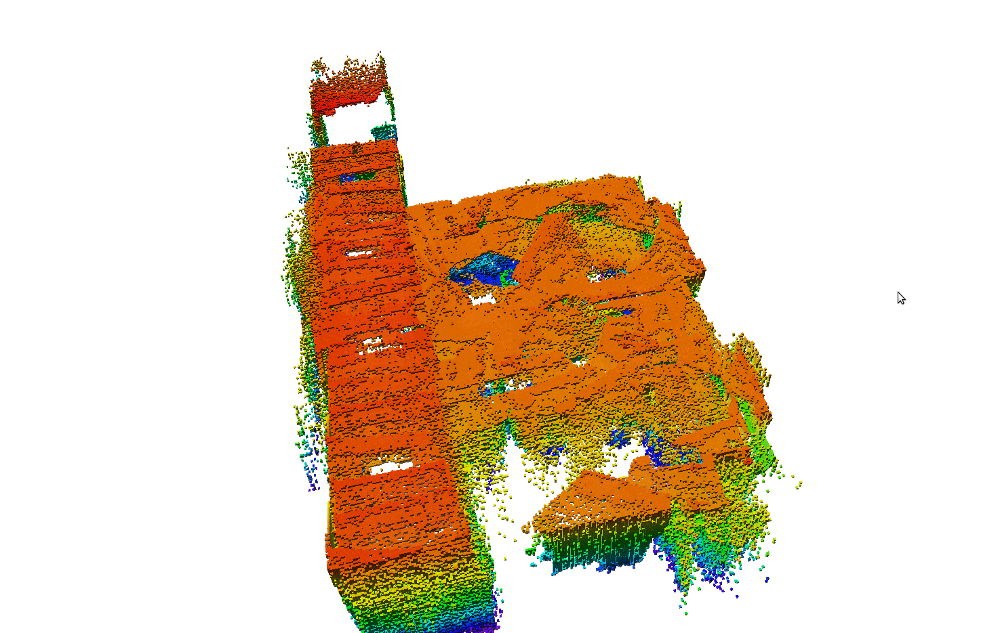
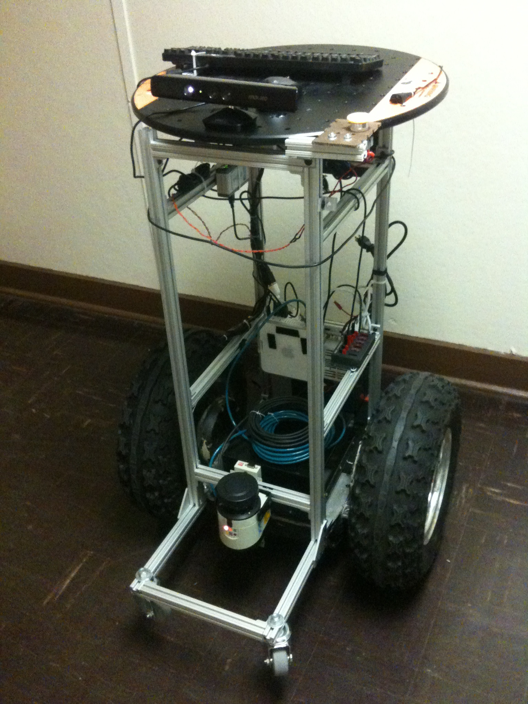
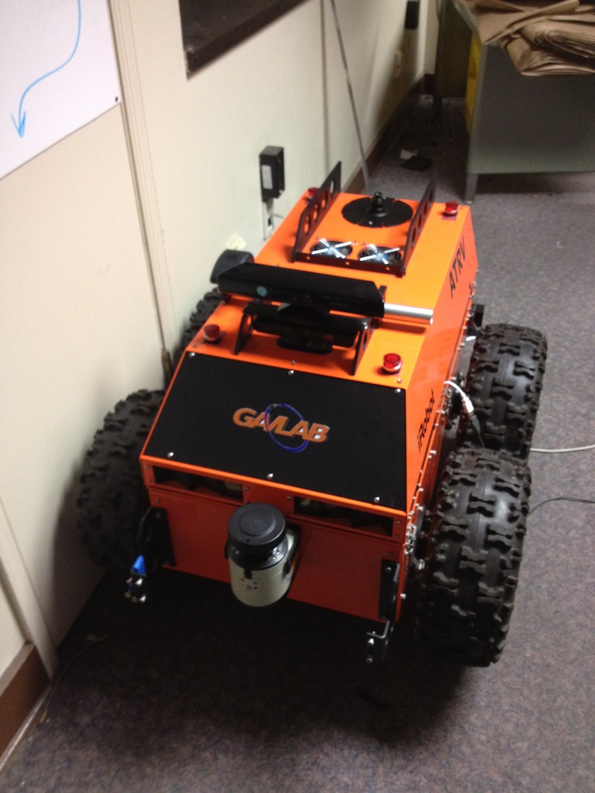

William J. Woodall IV
=====================

---

Outline
=======

* Background and Project Experience
    * Background
    * Autonomous Lawnmower
    * AUXOS Project
* Master's Work
* ROS Experience

---

Background
==========

* Born on December 17th, 1986 (25)
* Born in Decatur, AL
* Attended Austin High School in Decatur, AL
* Went to Auburn University for my B.S. in Software Engineering
* Currently pursuing Masters in Software Engineering at Auburn University

---

Autonomous Lawnmower
====================

* Won third place in the dynamic competition in 2010
* Won second place in the dynamic competition in 2011

---

ARMY Corp. AUXOS Project
========================

AUXOS (Autonomous UneXploded Ordinance Surveyor)

* Segway RMP 400
* Polaris Ranger EV
* Novatel SPAN GPS RTK+INS

---

ARMY Corp. AUXOS Project
========================

<iframe width="640" height="480" src="http://www.youtube.com/embed/b7ub1c_KIJE" frameborder="0" allowfullscreen></iframe>

---

Outline
=======

* Background and Project Experience
* Master's Work
    * Overview
    * Theory of Operation
    * ION Paper
    * Master's Thesis
    * Robotic Platforms
    * Problem 1: Navigation Solution
    * Problem 2: Timing and Computation
    * Solution 1
    * Problem 3: Kinect sensor error
    * Proposed Solution 2
    * What Next?
* ROS Experience

---

Master's Work
=============

Three Dimensional Teleoperation with the Microsoft Kinect

Goals:

* Develop 3D and photo-realistic teleoperation capabilities at Auburn
* Learn about the robotic perception field
* Try and reproduce previous work with the lost cost Kinect sensor

---

Theory of Operation
===================

adsfasdfasd

---

ION Paper
=========

Elements:

* Show the Kinect in teleoperation activities
* Show how octrees can help reduce bandwidth
* 

---

Master's Thesis
===============

In addition to ION Paper:

* Improve resilience to latency with vehicle model
* Take color image data and apply to octree visualization

---

Robot Platforms
===============

---

Outline
=======

* Background and Project Experience
* Master's Work
* ROS Experience
    * ROS on OS X
    * Fuerte and OS X

---

ROS on OS X
===========

* Started as a side project
* Approached by WillowGarage to take a more active role
* Currently users can use the majority of ROS using Homebrew on OS X

---

Questions?
==========

.fx: last-slide

.qr: 450|http://wjwwood.github.com/resume/wg_presentation/

Link: http://wjwwood.github.com/resume/wg_presentation/
